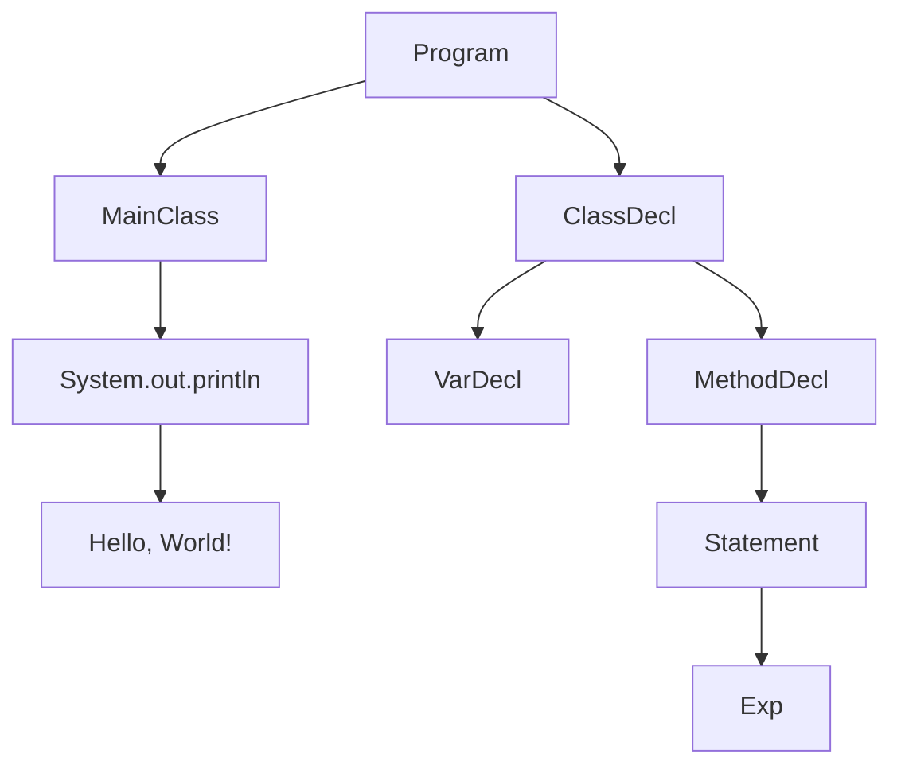

# Abstract Syntax Tree

- [Abstract Syntax Tree](#abstract-syntax-tree)
  - [Overview](#Overview)
  - [Nodes](#nodes)
  - [Visitors](#visitors)
    - [Orthogonal directions of modularity.](#orthogonal-directions-of-modularity)

## Overview
The abstract syntax tree (AST) is a tree representation of the source code. It is used to represent the structure of
the code in a way that is easy to manipulate and analyze. The AST is created by the parser, which reads the source
code and generates a tree of nodes that represent the different parts of the code.



<div align="end">
  <a  href="#">
    ⬆️
  </a>
</div>

## Nodes
The nodes of the AST represent the different elements of the source code, such as statements, expressions, and
declarations. Each node has a specific type and contains information about the code it represents. For example, a
node representing an assignment statement might contain information about the variable being assigned to and the
value being assigned.


```java
// Abstract base class for all AST nodes
public abstract class Node {
    public abstract <T> T accept(Visitor<T> v);
}
```

```java
// Example of a node representing an assignment statement
public class Assign extends Statement {
    private Identifier identifier;
    private Expression value;

    @Override
    public <T> T accept(Visitor<T> v) {
        return v.visit(this);
    }
}
```
*Generic Type `T` is used to allow the visitor to return different types of values depending on the operation being*

<div align="end">
  <a  href="#">
    ⬆️
  </a>
</div>

## Visitors
Each node in the AST has an `accept` method that takes a visitor as an argument. The visitor is an interface that
defines methods for each type of node in the AST. When the `accept` method is called on a node, it calls the 
appropriate method on the visitor, passing itself as an argument. This allows the visitor to perform operations on
the node and its children.

```java
// Visitor interface
public interface Visitor<T> {
    T visit(Assign assign);
    T visit(Identifier identifier);
    T visit(Expression expression);
    { ... }
}
```

<div align="end">
  <a  href="#">
    ⬆️
  </a>
</div>

### Orthogonal directions of modularity.
The visitor pattern allows for orthogonal directions of modularity. This means that the code that defines the nodes
of the AST is separate from the code that defines the operations that can be performed on the nodes. This separation
makes it easy to add new operations to the AST without modifying the existing code.

Examples of operations that can be performed on the AST include [**type checking**](Visitors/TypeChecking.md),
[**table of symbols**](Visitors/SymbolTable.md) and [**mermaid printer**](), code generation, and optimization(**like llvm**).

---
<div align="end">
  <a  href="#">
    Return to top
  </a>
</div>

