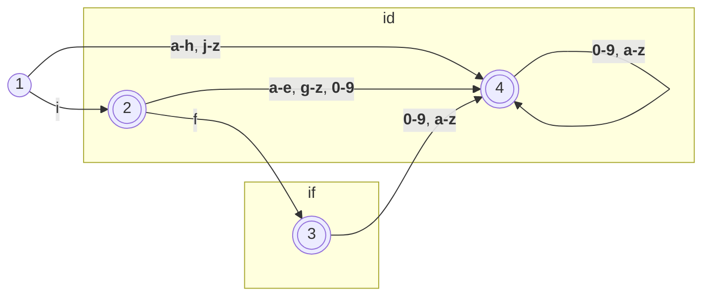

# Parser 

A parser is a critical component of a compiler, responsible for analyzing the grammatical structure of a program's source code and transforming it into a format understandable to the compiler. In the context of the mini Java to MIPS32 compiler, the parser plays the pivotal role of interpreting the syntactic constructs of mini Java language, such as statements, expressions, and control flow structures, and translating them into an intermediate form that can be further processed by the compiler. Key points of the parser include recognizing and interpreting tokens, applying defined grammar rules for mini Java, and detecting and reporting syntactic errors in the source code.


- [Parser](#parser)
  - [Tokens](#tokens)
    - [Punctuation](#punctuation)
    - [Keywords](#keywords)
    - [Types](#types)
    - [Literals](#literals)
    - [Operators](#operators)
  - [Statements](#statements)
  - [Expressions](#expressions)
  - [Usability](#usability)
  - [Example](#example)


## Tokens

Tokens are fundamental units of a programming language, representing various syntactic elements within the code. In the context of the mini Java to MIPS32 compiler, tokens are categorized into different types, each serving a distinct purpose in the parsing process.

### Punctuation

Punctuation tokens consist of symbols used for structuring code and delimiting expressions. 

| Type       | Examples |     | Type        | Examples |
| ---------- | -------- | --- | ----------- | -------- |
| `LSQUIRLY` | `{`      |     | `RSQUIRLY`  | `}`      |
| `LPAREN`   | `(`      |     | `RPAREN`    | `)`      |
| `LBRACKET` | `[`      |     | `RBRACKET`  | `]`      |
| `COMMA`    | `,`      |     | `SEMICOLON` | `;`      |
| `DOT`      | `.`      |     |             |          |

### Keywords

Keywords are reserved identifiers in the language that convey specific meanings or functionalities.

| Type     | Examples             |     | Type      | Examples  |
| -------- | -------------------- | --- | --------- | --------- |
| `CLASS`  | `class`              |     | `PUBLIC`  | `public`  |
| `STATIC` | `static`             |     | `VOID`    | `void`    |
| `MAIN`   | `main`               |     | `EXTENDS` | `extends` |
| `RETURN` | `return`             |     | `STRING`  | `string`  |
| `IF`     | `if`                 |     | `ELSE`    | `else`    |
| `WHILE`  | `while`              |     | `THIS`    | `this`    |
| `NEW`    | `new`                |     | `LENGTH`  | `length`  |
| `SOUT`   | `System.out.println` |     |           |           |

### Types

Types represent data categories in the language, defining the nature of variables and expressions.

| Type        | Examples  |
| ----------- | --------- |
| `INT`       | `int`     |
| `INT_ARRAY` | `int[]`   |
| `BOOLEAN`   | `boolean` |

### Literals

Literals represent constant values in the code, providing specific data to be processed or manipulated by the program. In the context of the mini Java to MIPS32 compiler, literals are categorized into different types, each representing a distinct category of constant values.


| Type              | Examples          |
| ----------------- | ----------------- |
| `TRUE_LITERAL`    | `true`            |
| `FALSE_LITERAL`   | `false`           |
| `IDENTIFIER`      | `gabs`, `saidx30` |
| `INTEGER_LITERAL` | `762`, `21`       |

### Operators

Operators are symbols used to perform operations on variables and values in a programming language. In the mini Java to MIPS32 compiler, operators are classified into different types, each representing a specific operation or manipulation.


| Type    | Examples |
| ------- | -------- |
| `EQ`    | `=`      |
| `AND`   | `&&`     |
| `LT`    | `<`      |
| `PLUS`  | `+`      |
| `MINUS` | `-`      |
| `STAR`  | `*`      |
| `BANG`  | `!`      |


## Statements

Statements are fundamental components of a program that perform specific actions or control the flow of execution. In the mini Java to MIPS32 compiler, various types of statements are supported, each serving a unique purpose:

- **Block Statement**: Represents a block of statements enclosed within curly braces `{}`. This allows for the grouping of multiple statements together.
  
- **Conditional Statement (if-else)**: Executes one of two statements based on the evaluation of a specified expression within the `if` condition. If the expression evaluates to true, the first statement is executed; otherwise, the second statement is executed.
  
- **Loop Statement (while)**: Repeatedly executes a statement as long as a specified expression within the `while` condition evaluates to true.
  
- **Print Statement**: Outputs the result of an evaluated expression to the standard output using `System.out.println`.
  
- **Assignment Statement**: Assigns the value of an evaluated expression to a variable identified by an identifier (`id = Exp`).
  
- **Array Assignment Statement**: Assigns the value of an evaluated expression to a specific index of an array identified by another expression (`id[Exp] = Exp`).

## Expressions

Expressions represent computations or values within a program, often involving operators, literals, variables, and method calls. In the mini Java to MIPS32 compiler, various types of expressions are supported, each serving a specific purpose in defining program behavior:

- **Binary Operation**: Represents an operation performed between two expressions, denoted as `Exp op Exp`.
  
- **Array Access**: Accesses an element within an array using square brackets, expressed as `Exp [Exp]`.
  
- **Array Length**: Retrieves the length of an array using the `length` property, indicated as `Exp . length`.
  
- **Method Invocation**: Calls a method on an object, specified as `Exp . id ( ExpList )`, where `id` represents the method name and `ExpList` denotes the list of arguments passed to the method.
  
- **Literals**:
  - `INTEGER_LITERAL`: Represents integer constants.
  - `true` and `false`: Boolean literals.
  
- **Identifiers**: Represents variables or object references within the program.
  
- **Keyword Expressions**:
  - `this`: Refers to the current object instance.
  - `new int [Exp]`: Creates a new integer array of the specified size.
  - `new id()`: Instantiates a new object of the specified class.
  
- **Unary Operation**: Represents a unary operation applied to an expression, such as negation (`!Exp`).

- **Parenthesized Expression**: Encloses an expression within parentheses to control evaluation order, as in `(Exp)`.

- **Expression List**: Represents a list of expressions used as arguments in a method call or array initialization. It is defined as `Exp ExpRest*`, where `ExpRest` allows for additional expressions separated by commas.

These expressions enable the creation of complex computations and interactions within mini Java programs, facilitating their translation into MIPS32 instructions.


## Usability

In the mini Java to MIPS32 compiler, the usability of the language constructs is defined by the grammar rules and structural conventions used in the code. Here are the key components that contribute to the usability of mini Java programs:

- **Start Symbol (Program)**:
  - The starting point of a mini Java program is defined by a `MainClass` followed by zero or more `ClassDecl`.

- **MainClass**:
  - A main class is defined by the following syntax:
    ```
    class id {
        public static void main(String[] id) {
            Statement
        }
    }
    ```
    This structure specifies the class containing the `main` method, which serves as the entry point for program execution.

- **Class Declaration (ClassDecl)**:
  - The syntax for defining a class is:
    ```
    class id {
        VarDecl* MethodDecl*
    }
    ```
    Optionally, a class can extend another class using the syntax:
    ```
    class id extends id {
        VarDecl* MethodDecl*
    }
    ```
    This structure defines the properties and methods associated with a class.

- **Variable Declaration (VarDecl)**:
  - Variables are declared using the syntax `Type id;`, specifying the data type and identifier for the variable.

- **Method Declaration (MethodDecl)**:
  - Methods are declared with the syntax:
    ```
    public Type id(FormalList) {
        VarDecl* Statement* return Exp;
    }
    ```
    This structure defines the signature, parameters, and body of a method.

- **Formal Parameters (FormalList)**:
  - Formal parameters are specified as a list of data types and identifiers, with optional additional parameters defined by `FormalRest`.

These conventions ensure consistency and readability in mini Java code, enhancing its usability and maintainability.

## Example

```java
class Factorial {
    public static void main(String[] a) {
        System.out.println(new Fac().ComputeFac(10));
    }
}
class Fac {
    public int ComputeFac(int num) {
        int num_aux;
        if (num < 1)
        num_aux = 1;
        else
            num_aux = num * (this.ComputeFac(num-1));
        return num_aux;
    }
}
```



